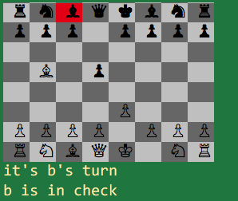

# Ruby Chess

A playable game of chess written in Ruby, with emphasis on object-oriented design.

### To Play

Clone this repo to the directory of your choice and run 'ruby game.rb' from the terminal.

### Technical Features

* Class inheritance
* Exceptions / Error handling
* Inheritance, Polymorphism, and DRY
* Information encapsulation
* Advanced moves: Castling and Queening (Pawn Promotion)

